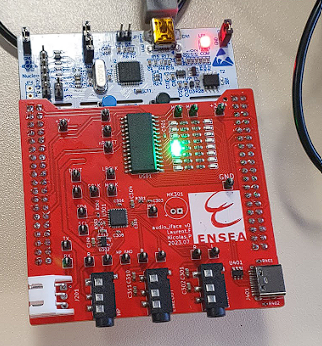
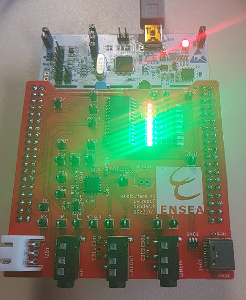
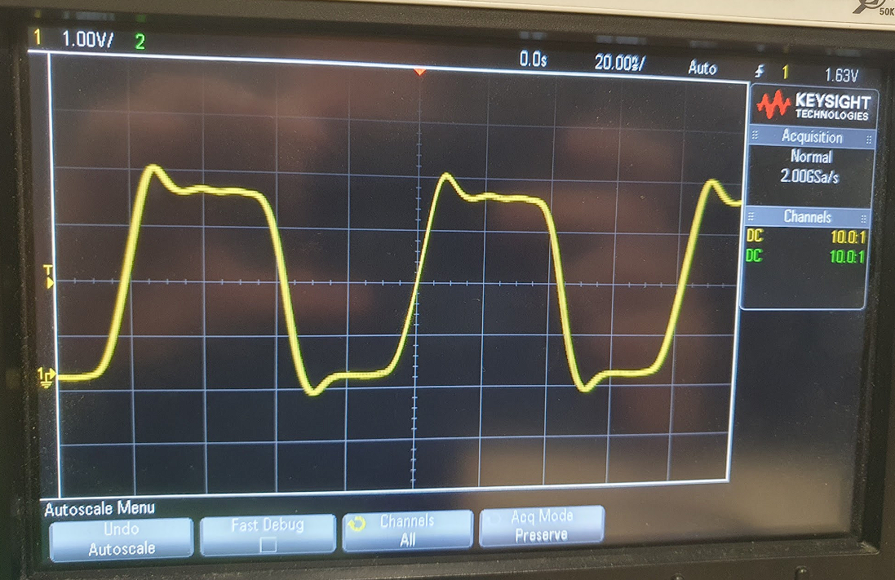

<p align="left">  </p>

# ESE_2324_AutoRadio

# TP de Synthèse – Autoradio


## 1 Démarrage

 1. On crée un projet pour la carte NUCLEO_L476RG et on initialise les périphériques.
 2. Aprés test, la LED LD2 et l’USART2 connecté à la STLink interne fonctionnent.
 4. On réutilise la fonction printf developpé dans un tp précédent.
 5. On active FreeRTOS en mode CMSIS V1.
 6. On fait fonctionner le shell de trois façon différentes :
(a) Dans une tâche,
(b) En mode interruption,
(c) Avec un driver sous forme de structure.

## 2 Le GPIO Expander et le VU-Metre
### 2.1 Configuration

1. La référence du GPIO Expander est MCP23S17 E/SO. Vous pouvez retrouver sa datasheet dans le dossier datasheet de ce projet github.
2. Sur le STM32, le SPI est utilisé dans notre projet est le SPI 3 
3. Quels sont les paramètres à configurer dans STM32CubeIDE ?
 
### 2.2 Tests

1. On fait clignoter la LED GPA6.

Code :
```c
void MCP23S17_Init(void) {
    uint8_t data[3];

    HAL_GPIO_WritePin(CS_GPIO_PORT, CS_PIN, GPIO_PIN_SET);   // CS HIGH
    HAL_Delay(1);

    data[0] = 0x40; // Adresse du registre IODIRB
    data[1] = 0x01; // Toutes les broches configurées comme sorties
    data[2] = 0x00;
    HAL_Delay(1);
    HAL_GPIO_WritePin(CS_GPIO_PORT, CS_PIN, GPIO_PIN_RESET); // CS LOW
    HAL_Delay(1);
    HAL_SPI_Transmit(&hspi3, data, 3, HAL_MAX_DELAY);
    HAL_Delay(1);
    HAL_GPIO_WritePin(CS_GPIO_PORT, CS_PIN, GPIO_PIN_SET);   // CS HIGH
}
```
```c
void MCP23S17_WriteGPIOA(uint8_t gpioa_state) {
    uint8_t data[3];

    data[0] = 0x40;
    data[1] = 0x12;
    data[2] = gpioa_state;
    HAL_GPIO_WritePin(CS_GPIO_PORT, CS_PIN, GPIO_PIN_RESET);
    HAL_SPI_Transmit(&hspi3, data, 2, HAL_MAX_DELAY);
    HAL_GPIO_WritePin(CS_GPIO_PORT, CS_PIN, GPIO_PIN_SET);
}
void MCP23S17_WriteGPIOB(uint8_t gpiob_state) {
    uint8_t data[3];

    data[0] = 0x40;
    data[1] = 0x13;
    data[2] = gpiob_state;
    HAL_GPIO_WritePin(CS_GPIO_PORT, CS_PIN, GPIO_PIN_RESET);
    HAL_SPI_Transmit(&hspi3, data, 3, HAL_MAX_DELAY);
    HAL_GPIO_WritePin(CS_GPIO_PORT, CS_PIN, GPIO_PIN_SET);
}
void Blink_LED(void) {
    printf("ENTERED FUNCTION\r\n");

    MCP23S17_WriteGPIOB(0xFF);
    printf("GPIOB LEDs ON\r\n");

    HAL_Delay(1000);
    printf("TEST DELAY\r\n");

    MCP23S17_WriteGPIOB(0x00);
}

```


3. Pour toutes les tester, on va faire preuve d'originalité et faire un chenillard.
```c
void MCP23S17_Chenillard(void) {
    uint8_t chenillard_state = 0x01;
    for (int i = 0; i < 8; i++) {
        MCP23S17_WriteGPIOB(~chenillard_state);
        HAL_Delay(200);
        chenillard_state <<= 1;
    }
}
```
<p align="center">  </p>

### 2.3 Driver

1. Écrivez un driver pour piloter les LED. Utilisez une structure.

   Typedef :
   
```c
#ifndef DriverLEDs
#define DriverLEDs

#include "stm32l4xx_hal.h"

typedef struct {
    SPI_HandleTypeDef *hspi;  // Handle SPI
    GPIO_TypeDef *cs_port;    // Port GPIO pour CS (Chip Select)
    uint16_t cs_pin;          // Pin GPIO pour CS
    uint8_t gpioa_state;      // État actuel des LEDs sur GPIOA
    uint8_t gpiob_state;      // État actuel des LEDs sur GPIOB
}
LED_Driver_t;

void LED_Driver_Init(LED_Driver_t *driver, SPI_HandleTypeDef *hspi, GPIO_TypeDef *cs_port, uint16_t cs_pin);
void LED_Driver_SetGPIOA(LED_Driver_t *driver, uint8_t state);
void LED_Driver_SetGPIOB(LED_Driver_t *driver, uint8_t state);
void LED_Driver_SetLED(LED_Driver_t *driver, uint8_t port, uint8_t led, uint8_t state);

#endif // DriverLEDs
```


3. Écrivez une fonction shell permettant d’allumer ou d’éteindre n’importe
quelle LED.
>[!Warning]
>
>Vu la connnection des LED elles s'allument si le bit d'activation est à 0 et non à 1 !!
><p align="center">  </p>

## 3 Le CODEC Audio SGTL5000
### 3.1 Configuration préalables

Le CODEC a besoin de deux protocoles de communication :

 — L’I2C pour la configuration,
 
 — L’I2S pour le transfert des échantillons audio.
 
Les configurations suivantes sont à faire sur le logiciel STM32CubeIDE dans
la partie graphique CubeMX. Le protocole I2S est géré par le périphérique SAI
(Serial Audio Interface).
1. Quelles pins sont utilisées pour l’I2C ?
  PB10PB11
3.   À quel I2C cela correspond dans le
STM32 ? CTRLDATA CTRLCLK

5. Activez l’I2C correspondant, laissez la configuration par défaut.
   
7. Configurez le SAI2 :
   
— SAI A : Master with Master Clock Out,

— Cochez I2S/PCM protocol,

— SAI B : Synchronous Slave,

— Cochez I2S/PCM protocol.

5. Si nécessaire, déplacez les signaux sur les bonnes broches. Vous pouvez
déplacer une broche avec un [Ctrl+Clic Gauche]. Les signaux du SAI
doivent être connectés au broches suivantes :

```
— PB12 : SAI2_FS_A
— PB13 : SAI2_SCK_A
— PB14 : SAI2_MCLK_A
— PB15 : SAI2_SD_A
— PC12 : SAI2_SD_B
```
<p align="center">  </p>

5. Dans l’onglet Clock Configuration, configurez PLLSAI1 pour obtenir la
fréquence To SAI2 à 12.235294 MHz.

7. Configurez les blocs SAI A et SAI B de la manière suivante :
8. Activez les interruptions.
9. Configurez le DMA pour le SAI A et le SAI B. Activez le mode circulaire.
10. Avant de passer à la suite, il est nécessaire d’activer l’horloge MCLK pour
que le CODEC fonctionne.

Pour cela, dans la fonction main(), après les
initialisations, ajoutez la ligne suivante :
```
__HAL_SAI_ENABLE(&hsai_BlockA2);
```
>[!Warning]
>
>Sans cette ligne, l’I2C ne fonctionne pas, parce que le CODEC ne
>reçoit pas d’horloge !

### 3.2 Configuration du CODEC par l’I2C
1. À l’aide d’un oscilloscope, vérifiez la présence d’une horloge sur le signal
MCLK.
<p align="center">  </p>

3. À l’aide de la fonction HAL_I2C_Mem_Read(), récupérez la valeur du registre
CHIP_ID (addresse 0x0000). L’adresse I2C du CODEC est 0x14.
4. Observez les trames I2C à l’oscilloscope.

5. Montrez à l’enseignant.
6. Cherchez dans la documentation du SGTL5000 la valeur à assigner aux
registres suivants :
```C
typedef enum sgtl5000_registers_enum
{
	SGTL5000_CHIP_ID = 0x0000,
	SGTL5000_CHIP_DIG_POWER = 0x0002,
	SGTL5000_CHIP_CLK_CTRL = 0x0004,
	SGTL5000_CHIP_I2S_CTRL = 0x0006,
	SGTL5000_CHIP_SSS_CTRL = 0x000A,
	SGTL5000_CHIP_ADCDAC_CTRL = 0x000E,
	SGTL5000_CHIP_DAC_VOL = 0x0010,
	SGTL5000_CHIP_PAD_STRENGTH = 0x0014,
	SGTL5000_CHIP_ANA_ADC_CTRL = 0x0020,
	SGTL5000_CHIP_ANA_HP_CTRL = 0x0022,
	SGTL5000_CHIP_ANA_CTRL = 0x0024,
	SGTL5000_CHIP_LINREG_CTRL = 0x0026,
	SGTL5000_CHIP_REF_CTRL = 0x0028,
	SGTL5000_CHIP_MIC_CTRL = 0x002A,
	SGTL5000_CHIP_LINE_OUT_CTRL = 0x002C,
	SGTL5000_CHIP_LINE_OUT_VOL = 0x002E,
	SGTL5000_CHIP_ANA_POWER = 0x0030,
	SGTL5000_CHIP_PLL_CTRL = 0x0032,
	SGTL5000_CHIP_CLK_TOP_CTRL = 0x0034,
	SGTL5000_SHIP_ANA_STATUS = 0x0036,
	SGTL5000_CHIP_ANA_TEST1 = 0x0038,
	SGTL5000_CHIP_ANA_TEST2 = 0x003A,
	SGTL5000_CHIP_SHORT_CTRL = 0x003C,
	SGTL5000_DAP_CONTROL = 0x0100,
	SGTL5000_DAP_PEQ = 0x0102,
	SGTL5000_DAP_BASS_ENHANCE = 0x0104,
	SGTL5000_DAP_BASS_ENHANCE_CTRL = 0x0106,
	SGTL5000_DAP_AUDIO_EQ = 0x0108,
	SGTL5000_DAP_SGTL_SURROUND = 0x010A,
	SGTL5000_DAP_FILTER_COEF_ACCESS = 0x010C,
	SGTL5000_DAP_COEF_WR_B0_MSB = 0x010E,
	SGTL5000_DAP_COEF_WR_B0_LSB = 0x0110,
	SGTL5000_DAP_AUDIO_EQ_BASS_BAND0 = 0x0116,
	SGTL5000_DAP_AUDIO_EQ_BAND1 = 0x0118,
	SGTL5000_DAP_AUDIO_EQ_BAND2 = 0x011A,
	SGTL5000_DAP_AUDIO_EQ_BAND3 = 0x011C,
	SGTL5000_DAP_AUDIO_EQ_TREBLE_BAND4 = 0x011E,
	SGTL5000_DAP_MAIN_CHAN = 0x0120,
	SGTL5000_DAP_MIX_CHAN = 0x0122,
	SGTL5000_DAP_AVC_CTRL = 0x0124,
	SGTL5000_DAP_AVC_THRESHOLD = 0x0126,
	SGTL5000_DAP_AVC_ATTACK = 0x0128,
	SGTL5000_DAP_AVC_DECAY = 0x012A,
	SGTL5000_DAP_COEF_WR_B1_MSB = 0x012C,
	SGTL5000_DAP_COEF_WR_B1_LSB = 0x012E,
	SGTL5000_DAP_COEF_WR_B2_MSB = 0x0130,
	SGTL5000_DAP_COEF_WR_B2_LSB = 0x0132,
	SGTL5000_DAP_COEF_WR_A1_MSB = 0x0134,
	SGTL5000_DAP_COEF_WR_A1_LSB = 0x0136,
	SGTL5000_DAP_COEF_WR_A2_MSB = 0x0138,
	SGTL5000_DAP_COEF_WR_A2_LSB = 0x013A
} sgtl5000_registers_t;
```
8. Créez une paire de fichier sgtl5000.c / sgtl5000.h
9. Dans le fichier sgtl5000.c, créez une fonction d’initialisation.
10. Dans cette fonction, écrivez le code permettant de configurer ces registres.


